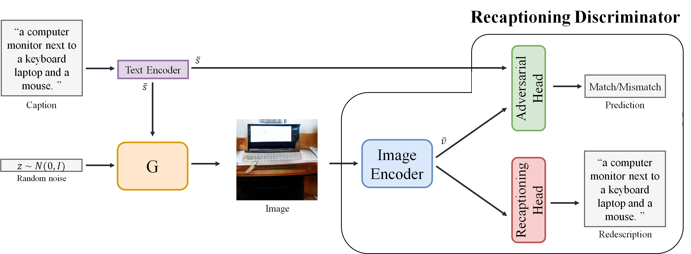
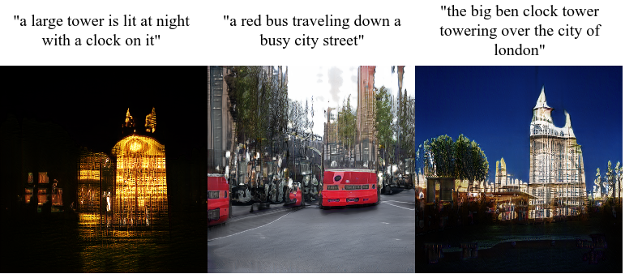

# RecapD

[Improving Text-to-Image Generation by Discriminator with Recaption Ability]()



### Installation

- Clone this repository
```
git clone https://github.com/POSTECH-IMLAB/RecapD.git
```
- Create conda enviroment and install all the dependencies
```
cd RecapD
conda env create --file env.yaml
```

### Preparation
1. Download the preprocessed metadata for [coco](https://drive.google.com/open?id=1rSnbIGNDGZeHlsUlLdahj0RJ9oo6lgH9) and save them to ```datasets/```
2. Download [coco](http://cocodataset.org/#download) dataset and extract the images and annotations to ```datasets/coco```
3. Download the [pre-trained text encoder](https://drive.google.com/open?id=1zIrXCE9F6yfbEJIbNP5-YrEe2pZcPSGJ) for coco and save it to ```datasets/DAMSMencoders/coco```
4. Build vocabulary for recaptioning model
  ```
  python scripts/build_vocabularay.py \
         --captions datasets/coco/annotations/captions_train2014.json \
         --vocab-size 10000 \
         --output-prefix datasets/vocab/coco14_10k \
         --do-lower-case
  ```


### Train RecapD

```
python scripts/train_recapD.py
```

### Test RecapD
Download [pretrained RecapD](https://drive.google.com/file/d/1or9fpMC6-cCVCGol39f_kOI1Vc0fZvBT/view?usp=sharing) and save it to ```exps/256_cond_cap/checkpoint.pth```
Add text for generation in ```example_sentences.txt``` 
```
python scripts/gen_recapD.py --resume-from exps/256_cond_cap/checkpoint.pth
```
Generated samples



### Reference
The code is based on [DF-GAN](https://github.com/tobran/DF-GAN) and [VirTex](https://github.com/kdexd/virtex)
